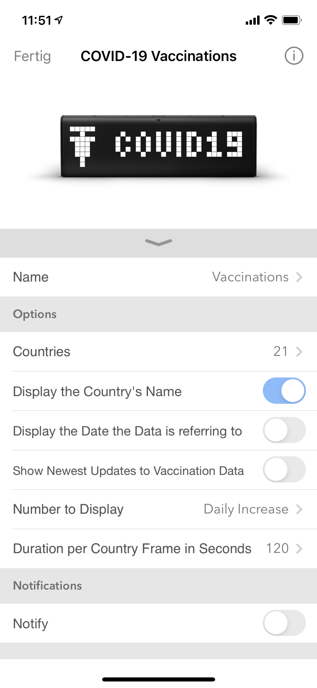

## Covid-19 Vaccinations on LaMetric
## About
This app shows the **progress in the COIVD-19 vaccinations** world wide on LaMetric Time.
You can **select specific countries** you're interested in, or select none to see a random collection of all countries.

Moreover, you can decide if you see **daily vaccinations** or the number of **total vaccinations** i.e. number of people having received the first vaccination jab.  
On top of that a **progress bars** indicates how many people are vaccinated relative to the entire population.

**You can install the app [here](https://apps.lametric.com/apps/covid-19_vaccinations/11938).**

The data comes from the awesome [ourWorldInData](https://github.com/owid/covid-19-data/tree/master/public/data/vaccinations) project.

  

<br>

## Features
* Show **per day vaccinations**
* Or show **number of people vaccinated** (1st jab)
* Select your own country
* Select all countries your interested in
* Select to see the country's name first
* Filter for new data only
* Display the date the vaccination numbers are referring to
* Set the time a country is displayed (default is 120 seconds)
* LaMetric is updated every 10min
* Server data is updated every hour

<br>

## App

### Install
You can install the app [here](https://apps.lametric.com/apps/covid-19_vaccinations/11938).

### Settings
You can open the settings by clicking on the App inside the LaMetric App on your phone.  
#### The following list explains all settings:
* *Countries* is using [Alpha-3 Codes (ISO 3166-1)](https://en.wikipedia.org/wiki/ISO_3166-1_alpha-3).  
* *Display the Country's Name* creates a leading Frame displaying the countries name.
* *Display the Date the Data is referring to* adds the date the behind the countries name.
* *Show Newest Updates to Vaccination Data* sorts the countries server side by date. A side effect can be that countries with older vaccination data are not displayed due to LaMetric's restriction of 20 frames. (Suggestions to fix this are more than welcome)
* *Number to Display* lets users choose between *Daily Increase* or *Total Vaccinations*.
* *Duration per Country Frame in Seconds* sets the time a frme is displyed in seconds (default is 120).

    

<br>
<br>

## Server 

This repository contains the entire code necessary to run this app on cloudflares serverless worker environment. 
You can use [wrangler](https://github.com/cloudflare/wrangler) to debug and test the code locally on your machine. For this you need to adjust the [wrangler-example.toml](wrangler-example.toml) and rename it to `wrangler.toml`. More information can be found [in the documentation](https://workers.cloudflare.com/docs/quickstart/).

#### Cloudflare
Once you are ready, you can publish your code to cloudflare by running the following command:

```
wrangler publish
```

#### Serverless

To deploy using serverless add a [`serverless.yml`](https://serverless.com/framework/docs/providers/cloudflare/) file.
